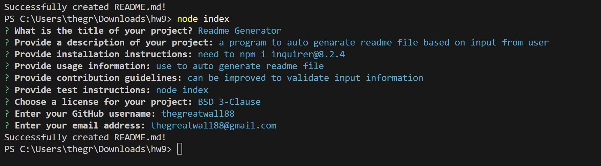

# wedas

## Description
dsadsa

## Table of Contents
- [Installation](#installation)
- [Usage](#usage)
- [Contributing](#contributing)
- [Tests](#tests)
- [License](#license)
- [Questions](#questions)

## Installation
dsdadsad

## Usage
sdadasd

## Contributing
sda

## Tests
dasdsada

## License

This project is licensed under the MIT license. For more information, see the [license documentation](https://opensource.org/licenses/MIT).

## Media
### Example Photo

### Example Video
[Watch the Video]()

## Questions
If you have any questions, please reach out to me:

GitHub: [dasda](https://github.com/dasda)
Email: sada
