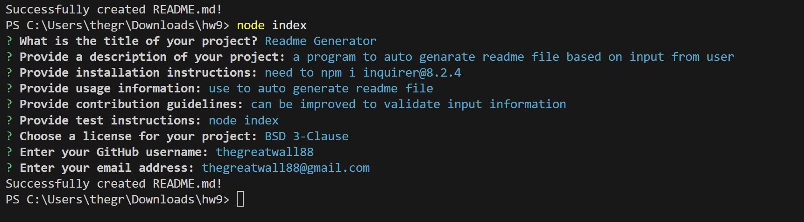
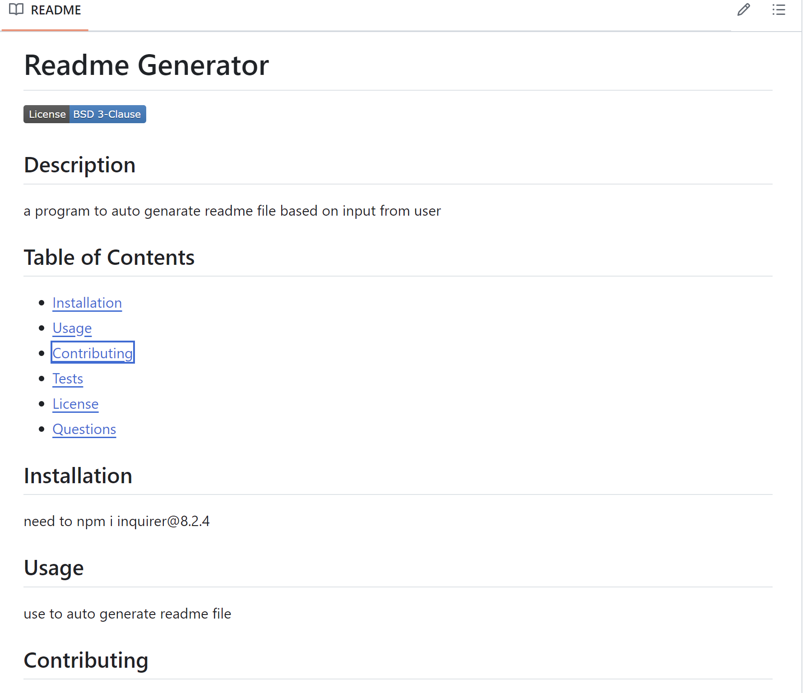

# README generator using Node

## Description
Use Node Inquirer to create questions from user to collect inputs to build README file.

## Table of Contents
- [Installation](#installation)
- [Usage](#usage)
- [Contributing](#contributing)
- [Tests](#tests)
- [License](#license)
- [Questions](#questions)

## Installation
You need to npm i inquirer@8.2.4 in order to run the program. then run the node index from command line to start the process.

## Usage
This can be use to auto generate README file to guaranteed professional look.

## Contributing
https://coding-boot-camp.github.io/full-stack/github/professional-readme-guide

## Tests
node index to run test and answer all questions, then it should create an README.md file

## License

This project is licensed under the Apache-2.0 license. For more information, see the [license documentation]().

## Media
### Example Photo

### Example Video
[Watch the Video](./assets/video/demo.webm)

## Questions
If you have any questions, please reach out to me:

GitHub: [thegreatwall88](https://github.com/thegreatwall88)
Email: thegreatwall88@gmail.com
